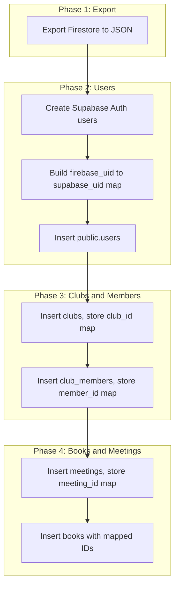

# Firestore to Supabase Data Migration Plan

This document outlines how to import existing data from a Firebase/Firestore project into the Supabase-backed Bookshoes app.

---

## 1. Firestore vs Supabase Structure Mapping

### Firestore Collection Layout (inferred from types and `parseCollectionPath`)

| Firestore Path | Supabase Table | Notes |
|----------------|----------------|-------|
| `clubs` | `clubs` | Top-level; doc ID → new UUID |
| `users` | `users` | Top-level; **Firebase UID ≠ Supabase UID** (critical) |
| `clubs/{clubId}/members` | `club_members` | Subcollection; doc ID → new UUID |
| `clubs/{clubId}/books` | `books` | Subcollection; doc ID → new UUID |
| `clubs/{clubId}/meetings` | `meetings` | Subcollection; doc ID → new UUID |

### Field Mapping

**Clubs:** `name`, `isPrivate` → `is_private`, `tagline`, `description`

**Users:** `uid` → `id` (Supabase Auth), `email`, `displayName` → `display_name`, `photoURL` → `photo_url`, `activeClub` → `active_club_id`, `memberships` (array of club IDs)

**Members:** `uid` → `user_id`, `role`; doc ID in Firestore may be `uid` or auto-generated

**Books:** `volumeInfo.*` → snake_case columns; `scheduledMeetings` = meeting IDs (need mapping); `ratings`, `progressReports` = JSONB (need `memberId`/`user.uid` mapping)

**Meetings:** `date`, `location.address` → `location_address`, `location.lat/lng`, `location.remoteInfo.link/password`; `comments` = JSONB (need `user.uid` mapping in each comment)

---

## 2. Critical Challenge: User ID Mapping

**Firebase Auth and Supabase Auth produce different UIDs for the same Google account.**

All references to users in the data (comments, ratings, progress reports, memberships) use Firebase UIDs. Supabase `users` and `auth.users` use Supabase UIDs. We must build and apply a mapping.

### Strategy: Pre-create Users via Supabase Admin API

1. Export Firebase users (uid, email, displayName, photoURL) from Firestore `users` collection.
2. For each Firebase user, create a Supabase Auth user via Admin API (`auth.admin.createUser`) with the same email. Supabase returns the new `id` (Supabase UID).
3. Build mapping: `firebase_uid → supabase_uid`.
4. When users later sign in with Google, Supabase will match by email and link to the existing auth user (no duplicate).

**Alternative:** If you cannot pre-create users (e.g. no service role access), you can run a "link on first sign-in" flow: when a user signs in, match by email to the exported Firebase user, store `firebase_uid → supabase_uid` in a mapping table, then run the migration in batches as users sign in. This is more complex and delays full migration.

---

## 3. Migration Order (Dependency Graph)



1. **Clubs** – no user FKs in the row; insert first, store `firestore_club_id → supabase_club_uuid`.
2. **Users** – create in `auth.users` (Admin API) and `public.users`; store `firebase_uid → supabase_uid`.
3. **Club members** – need `club_id` (mapped) and `user_id` (mapped); insert, store `firestore_member_doc_id → supabase_club_members.id`.
4. **Meetings** – need `club_id` (mapped); insert, store `firestore_meeting_id → supabase_meeting_uuid`.
5. **Books** – need `club_id` (mapped), `scheduled_meetings` (mapped meeting UUIDs), `ratings` (map `memberId`), `progress_reports` (map `user.uid`).

---

## 4. ID Mapping Tables

Maintain in-memory or file-based maps during the migration script:

| Map | Key | Value |
|-----|-----|-------|
| `clubMap` | Firestore club doc ID | Supabase `clubs.id` (UUID) |
| `userMap` | Firebase UID | Supabase `users.id` (UUID) |
| `memberMap` | `clubId + userId` or Firestore member doc ID | Supabase `club_members.id` |
| `meetingMap` | Firestore meeting doc ID | Supabase `meetings.id` (UUID) |

For `memberMap`: Firestore member doc ID may be the user's UID (if used as doc ID) or auto-generated. Check your Firestore data. Use `(clubId, firebaseUserId)` as a stable key if doc IDs are inconsistent.

---

## 5. Data Transformations

### Books

- `scheduledMeetings: string[]` → map each Firestore meeting ID to Supabase meeting UUID via `meetingMap`.
- `ratings: BookRating[]` → each `memberId` must map to Supabase `club_members.id`. If Firestore used `uid` as member doc ID, resolve `(clubId, memberId)` → `club_members.id` from `memberMap`.
- `progressReports: BookProgressLog[]` → each `user.uid` → `userMap` to get Supabase user ID; store minimal `{ user: { uid, displayName, photoURL }, currentPage }` (uid = Supabase uid after mapping).

### Meetings

- `comments: MeetingComment[]` → each `user.uid` → `userMap`; replace with Supabase uid in the stored comment object.
- `taggedUsers`, `taggedBooks` in comments → map to Supabase UUIDs if present.

### Users

- `memberships` → array of Firestore club IDs; map each to Supabase club UUID via `clubMap`.
- `activeClub` → map via `clubMap`.

---

## 6. Implementation Approach

### Option A: Node.js Script (Recommended)

Create a one-off script (e.g. `scripts/migrate-firestore-to-supabase.ts`) that:

1. Uses **Firebase Admin SDK** to read Firestore (or uses a JSON export if you prefer).
2. Uses **Supabase client with service role key** to bypass RLS and insert data.
3. Uses **Supabase Auth Admin API** to create users (`createUser` with email).

**Prerequisites:**

- Firebase project service account JSON (for Firestore read).
- Supabase project URL + **service role key** (not anon key).
- Disable or relax RLS temporarily for the migration, or use service role (which bypasses RLS).

### Option B: Firestore Export + Supabase Import

1. Use `gcloud firestore export` to export Firestore to GCS.
2. Write a script that reads the export format and inserts into Supabase (same logic as Option A, but reads from export files instead of live Firestore).

### Option C: Manual JSON Export

1. Use a small script or Firebase Console to export collections to JSON.
2. Run the migration script against those JSON files.

---

## 7. Script Structure (Pseudocode)

```text
1. Load Firebase Admin SDK, init with service account
2. Load Supabase client with service role key
3. Export clubs from Firestore → insert into Supabase, build clubMap
4. Export users from Firestore
5. For each user: createUser via Supabase Auth Admin, insert into public.users, build userMap
6. For each club:
   a. Export members from clubs/{clubId}/members
   b. Insert club_members (user_id from userMap), build memberMap
7. For each club:
   a. Export meetings from clubs/{clubId}/meetings
   b. Insert meetings, build meetingMap
8. For each club:
   a. Export books from clubs/{clubId}/books
   b. Transform scheduledMeetings, ratings, progressReports using maps
   c. Insert books
9. Optionally: user_presence (if you have Firebase Realtime data to migrate)
10. Log summary and any errors
```

---

## 8. RLS and Auth During Migration

- **Service role key** bypasses RLS, so you can insert directly.
- If you create users via Admin API, they will not have a password; they sign in with Google. Ensure "Google" provider is enabled in Supabase.
- After migration, re-enable any RLS policies you relaxed. The existing RLS in `20250214000001_rls_and_auth.sql` should work once data is in place.

---

## 9. Validation and Rollback

- Run migration against a **staging Supabase project** first.
- After migration: spot-check clubs, members, books, meetings, and user memberships.
- Keep Firestore read-only (do not delete) until you are confident.
- Supabase has no built-in "rollback" for bulk inserts; restore from a pre-migration backup if needed.

---

## 10. Open Questions to Resolve Before Coding

1. **Firestore member doc IDs:** Are they equal to `user.uid` or auto-generated? (Affects `memberMap` and `ratings.memberId` mapping.)
2. **Firebase project access:** Do you have the service account JSON and Firestore read permission?
3. **Supabase service role key:** Do you have it for the target project?
4. **User creation:** Are you okay creating users via Admin API (they will sign in with Google on first use), or do you prefer a "link on sign-in" approach?
5. **Duplicate handling:** If the migration is run twice, should it skip existing records (idempotent) or fail? Recommend: check for existing data and skip/update.

---

## 11. File Layout (Implemented)

```text
scripts/
  migrate-firestore-to-supabase.ts   # Main migration script
  export-firestore-to-json.ts        # Export Firestore to JSON (optional path)
  firestore-export.json              # Created by export script (gitignored)
.env.migration.example               # Template for credentials
.env.migration                      # Your credentials (gitignored)
```

**Usage:**
1. Copy `.env.migration.example` to `.env.migration` and fill in credentials.
2. **Live Firestore:** `pnpm run migrate:firestore`
3. **From JSON:** `pnpm run export:firestore` then `pnpm run migrate:firestore -- --from-json`
4. **Dry run:** Add `--dry-run` to test without writing.
